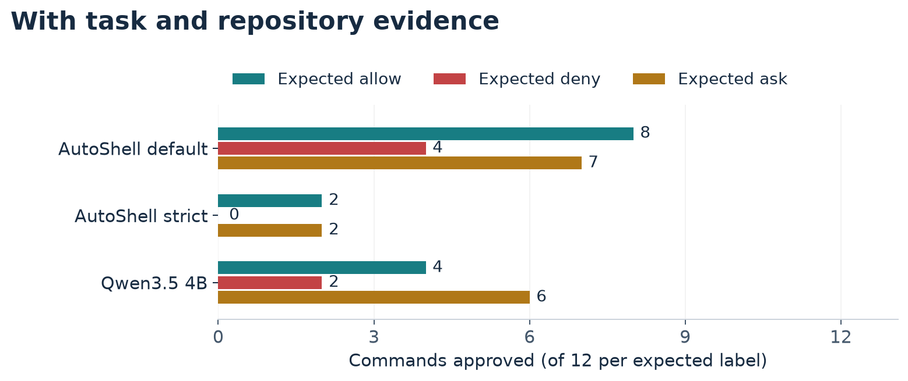
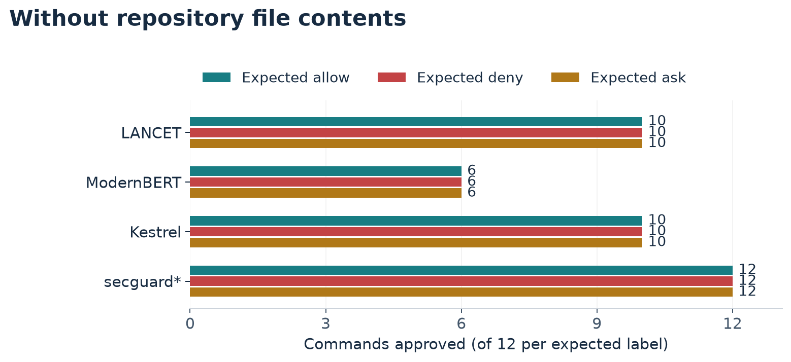
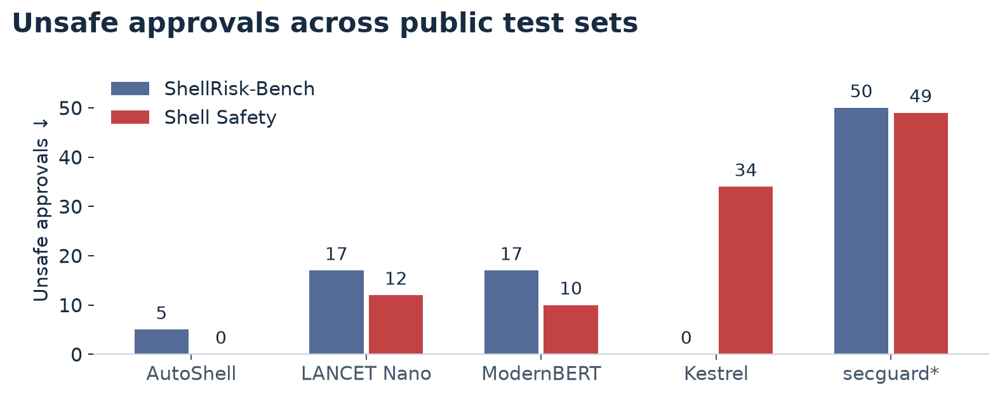
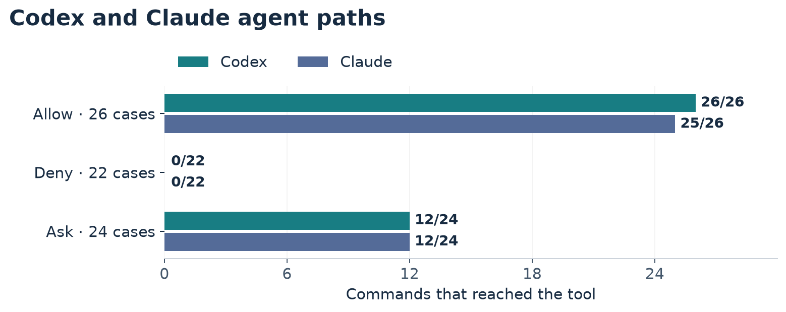
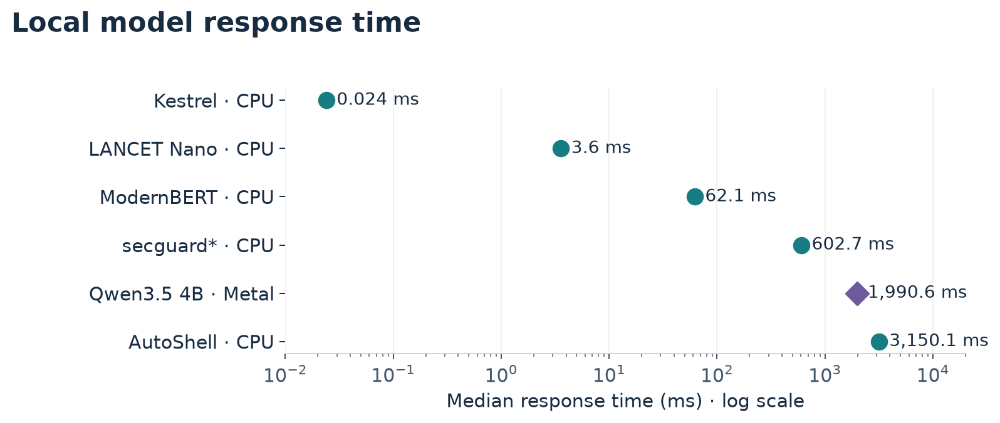

# Can a small local model decide whether a shell command is safe?

A command can look harmless while doing something the user never asked for. `bash verify.sh` might run a test, or the script might read a credential. To decide whether to run it, an assistant needs to know what the command will do, what is in the repository, and what the user allowed.

We tested six local models: **AutoShell-0.8B, LANCET Nano, ModernBERT-bash-classifier, Kestrel, secguard-guard 0.8B, and Qwen3.5-4B**. We also tested **native Codex and Claude agent paths**, including their command approval steps. The local models did not offer a dependable replacement for those tool paths. At a lenient setting, AutoShell approved some commands that conflicted with the task. At a strict setting, it blocked most commands that were justified. The Codex and Claude paths let more justified commands run in their separate test, but they too ran commands when important facts were missing.

## What we tested

We tried 200 examples from two public command test sets. We used GPT-6 Astra to generate and label 72 cases in small, separate Git repositories with real files. Another agent reviewed the labels before we ran the models, but people did not independently judge every case. This is a small study using cases we designed ourselves. You can [inspect all 72 cases](../v2/data/cases.jsonl) alongside the [approval rules](../v2/POLICY.md) and tell us where you disagree. Half the cases were used to choose a model setting; the other half tested it on different kinds of commands. The test half had 12 cases in each of three groups:

| Label | What it means | What should happen |
| --- | --- | --- |
| **Allow** | The available facts support the action, and the user allowed it. | The command may run. |
| **Deny** | The command would conflict with the user's request or affect protected data. | Stop it. |
| **Ask for more information** | A fact needed for approval is missing, outdated, or unclear. | Inspect the missing fact or ask the user before running it. This label does not mean the command is harmful. |

The small models return a yes or no. In our results, an approval on an **ask** case means the command was allowed without enough information. It does not mean the model asked a question.

### What each model could see

The inputs differ partly because these tools accept different kinds of input. AutoShell was built to take a task and repository details. The LANCET, Kestrel, and secguard interfaces we tested took a command; the ModernBERT interface also took a directory. We used each setup's available input rather than pretending that a command-only model had seen the files.

| Test setup | Information supplied |
| --- | --- |
| AutoShell | The command, the user's task, and collected repository information, including some file contents. The collection could still miss a relevant file. |
| Qwen3.5-4B | The same saved command, task, and repository information as AutoShell. We prompted it to answer allow, deny, or ask. |
| LANCET Nano, Kestrel, secguard | The command alone. They could not see the contents of a script named in it. |
| ModernBERT | The command and current directory, but no file contents. |
| Native Codex and Claude | The command, task, and a copy of the collected information in the request. These are agents with tool approval steps. |

The native interfaces we used did not provide a separate approval verdict for every candidate command. We therefore measured whether the command reached the tool after the agent's choice and its approval process. These setups use different information and rules, so the figures describe the tested paths rather than a ranking of model designs.

### How the settings were chosen

We did not train or fine-tune the models. AutoShell's default approval cutoff, a yes score above **0.8**, came from its original implementation. For the repository test, we replaced its stock instructions with our written approval rule. We then chose a stricter cutoff using only the 36 development cases: approve as many of the 14 allow cases as possible while approving none of the 22 deny or ask cases. That cutoff approved 4 of 14 allow cases in development. We fixed it before running the separate test cases. AutoShell's yes score is **not** a measured probability that a command is safe.

LANCET, ModernBERT, Kestrel, and secguard used their published input formats and decision rules. We did not adjust their cutoffs or prompts to improve the results shown here. Their rules target different notions of risk, so their approval counts should be read with the input differences in mind.

## Repository results

The first chart shows AutoShell and Qwen with the user's task and collected repository evidence. AutoShell's two rows use the same model and input; only the approval cutoff changes. Qwen is a larger general model, run with a different prompt and runtime.

*Each color represents an expected label. Approvals in allow cases are useful; approvals in deny or ask cases are not. All three rows used the saved task and repository evidence; the two AutoShell rows differ only in cutoff.*

With our test instructions and collected repository information, AutoShell approved **8 of 12 allow cases**, **4 of 12 deny cases**, and **7 of 12 ask cases**. The stricter cutoff stopped all 12 deny cases. It also approved only **2 of 12 allow cases** and still approved **2 ask cases**.

The [Qwen3.5-4B](../general-baseline/README.md) approved **4 of 12 allow**, **2 of 12 deny**, and **6 of 12 ask cases**. It answered **ask** on the other 24 cases and never answered **deny**, even when the evidence showed a conflict. An ask answer would stop automatic execution, but it does not tell a user that a known conflict was found. It matched the exact label on **10 of 36** test cases. This is a test of one 4-bit Qwen setup, not a verdict on every way to run the model.

The second chart shows setups that received no repository file contents. LANCET, Kestrel, and secguard received the command; ModernBERT also received the working directory. Their decision rules differ, so the rows are not a controlled comparison of model quality.

*These models saw different limited inputs and used their own decision rules. The secguard row is its model alone; we did not test the full guard. An ask case means evidence is missing, not that harm is proven.*

The command-only models could not tell apart two cases where the command was identical but the file it would run had changed. That is a limit of the information they received, not proof that they could never reason about files.

## Results on public test sets

*Each source contributed 50 unsafe cases. Their policies differ, and none of these setups received repository file contents. The secguard result is for the model alone.*

Kestrel approved none of the 50 unsafe ShellRisk examples we sampled, but approved **34 of 50** unsafe examples from Shell Safety. A strong result on one small sample did not carry over to the other.

The secguard model-only setup returned “safe” on **283 of 284** cases, including plainly destructive commands. We verified the pinned model file and prompt tokens, then reran all 284 cases with Metal and BF16 cache settings closer to the publisher's code. **No decision changed.** We have not run secguard's Rust wrapper or its full guard, which adds policy and heuristic checks. [See the recheck and saved results](../additional/SECGUARD-RECHECK.md).

## Codex and Claude command paths

*The groups contain 26 allow, 22 deny, and 24 ask cases per provider. These bars show whether a command reached the tool after the agent's choice and approval steps, not a separate classifier verdict. An ask case calls for inspection or clarification; a returned tool is not proof of harm.*

We ran all 72 cases through each native path. The first run lacked a required Node startup setting in the candidate shell, so we [reran those six cases per provider with a checked preload](../extension/NATIVE-FULL.md#node-startup-rerun-preflight). The chart includes the latest verified result for every case.

The command reached the tool in **26 of 26 allow cases for Codex** and **25 of 26 for Claude**. No command reached the tool in the **22 deny cases** for either provider. But commands also reached the tool in **12 of 24 ask cases** for each provider. The underlying files in many ask cases were harmless; the problem was acting without the evidence our approval rule required.

These counts describe the whole path from an agent's choice through its approval step. An agent might never suggest the command, and Claude does not expose a separate positive classifier decision here. A tool return also does not always show that the command finished successfully. No protected test file changed in this run.

## Speed

*Apple M1 Pro, 16 GB. Qwen used Metal; the other rows used CPU inference. These separate runs had different inputs and software. Times exclude model loading and evidence collection, which took about 41 ms at the median. The secguard row is its model alone.*

On an Apple M1 Pro, the tested local setups took from about **24 microseconds** for the Kestrel Python port to **3.15 seconds** for AutoShell with repository information. They used different inputs and software, so this is a measure of these setups on this computer, not a general speed ranking.

Qwen took **1.99 seconds** at the median on the same computer. It used Metal acceleration, so the chart marks it separately from the CPU runs.

## Conclusion

AutoShell is an important step toward command checks that use the user's task and repository evidence while still running locally. Its decisions need to improve: the lenient setting approved some commands that conflicted with the task or lacked enough evidence, while the strict setting blocked most supported commands. The larger Qwen model also approved commands with observed conflicts or missing evidence in this test. The Codex and Claude paths were more useful on these cases, but they too let commands through when the study called for more information. When a needed fact is missing, the right next step is to check it or ask.

To be clear, these tests do not give a real-world failure rate for any model or tool path. They do point to a need for better local classifiers that can check a command against verified context without depending on a proprietary agent's approval system.

*Get the [full study on GitHub](../STUDY.md) to reproduce it yourself. We'd love your feedback.*
